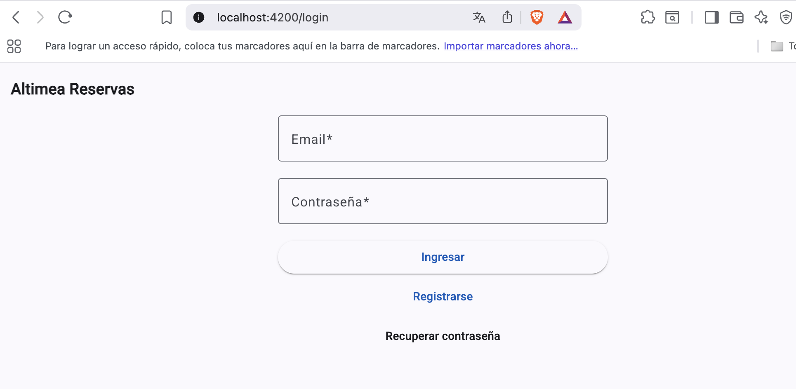
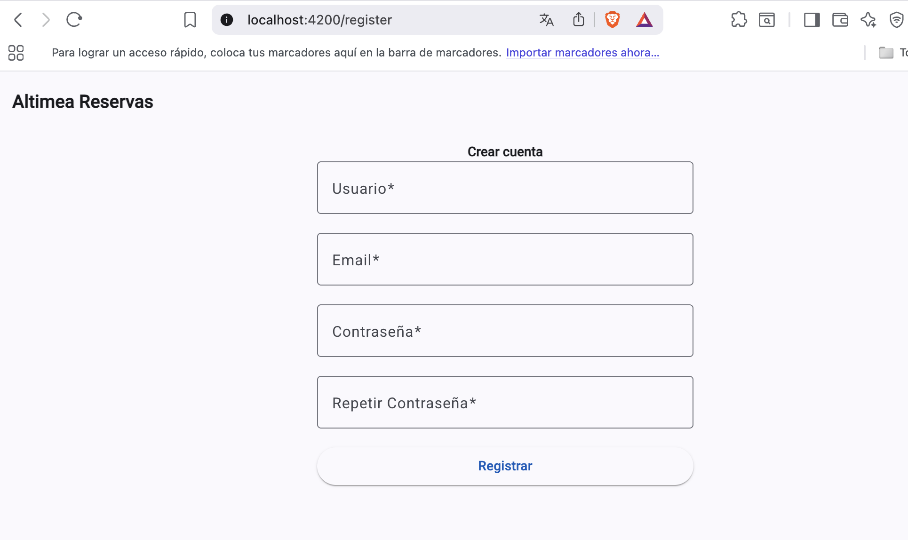
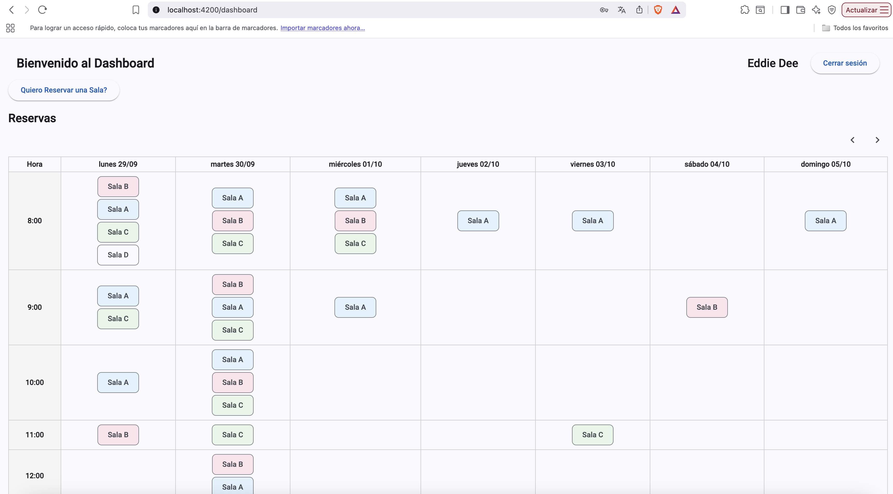
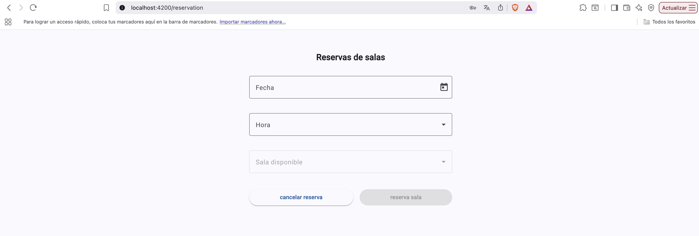
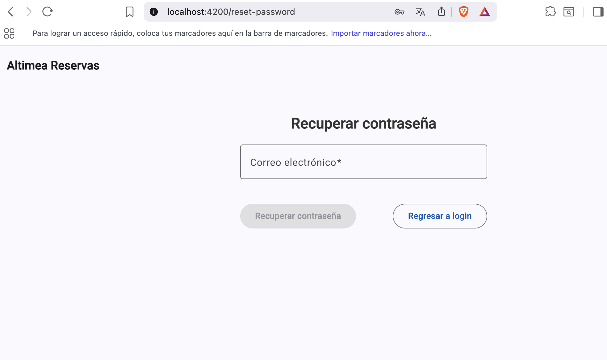
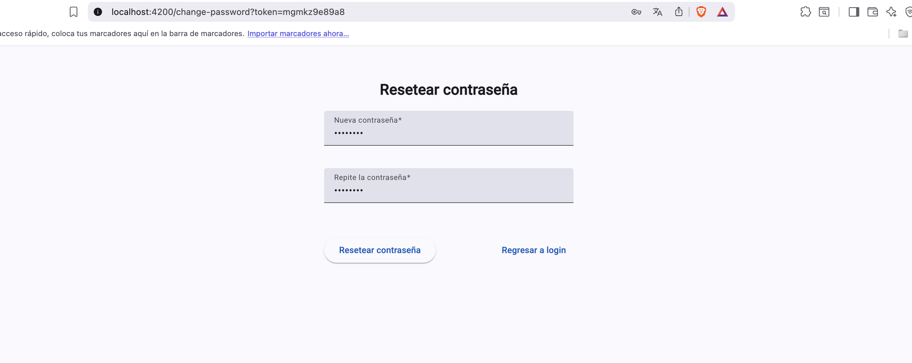

# AltReservasWeb

Este proyecto se generó con Angular CLI versión 20.3.3 [Angular CLI](https://github.com/angular/angular-cli)

## Servidor de desarrollo

Para iniciar el servidor de desarrollo local, ejecute:

```bash
ng serve
```
Una vez que el servidor esté en funcionamiento, abra su navegador y acceda a http://localhost:4200/. La aplicación se recargará automáticamente al modificar cualquier archivo de origen.

## Generación de código

Angular CLI incluye herramientas avanzadas para la generación de código. Para generar un nuevo componente, ejecute:

```bash
ng generate component component-name
```
Para obtener la lista completa de esquemas disponibles (como `components`, `directives` o `pipes`), ejecute:

```bash
ng generate --help
```

## Compilación

Para compilar el proyecto, ejecute:

```bash
ng build
```

Esto compilará el proyecto y almacenará los archivos compilados en el directorio `dist/`. Por defecto, la compilación de producción optimiza la aplicación para un mejor rendimiento y velocidad.


## Vistas del Proyecto construido
- /login


- /register


- /dashboard


- /reservation


- /reset-password


- /change-password

